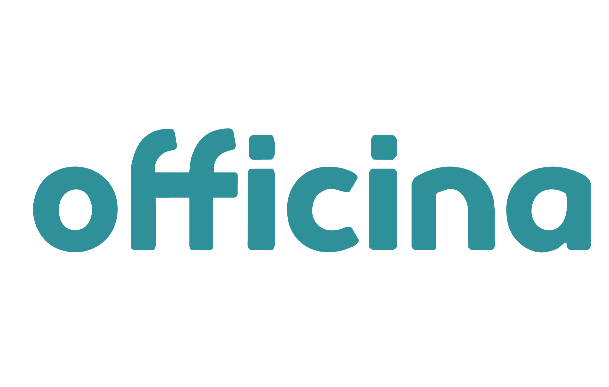
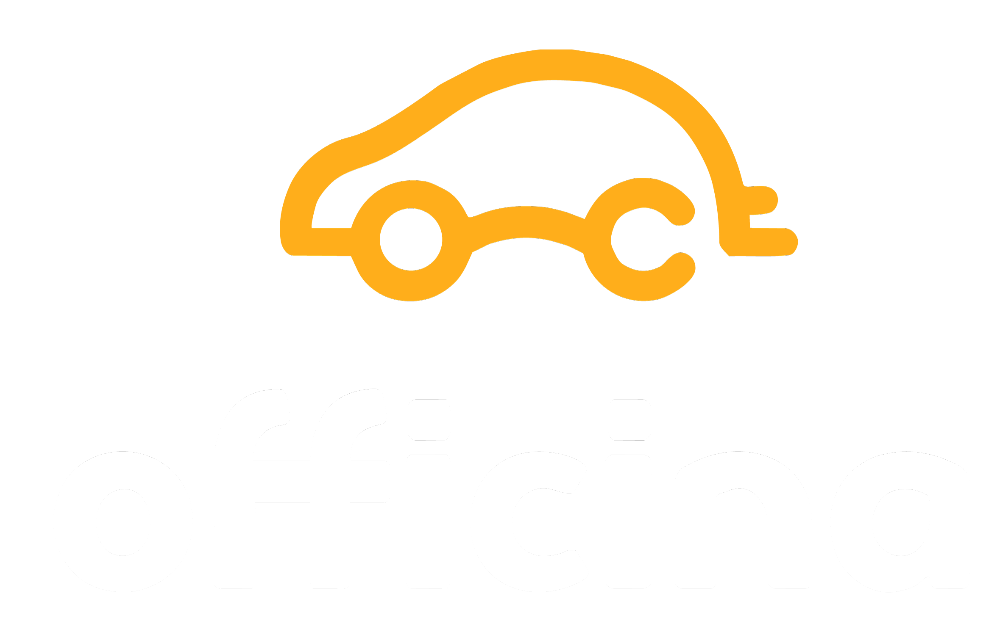

# ASSETS — Officina App
> Este arquivo documenta assets de marca e regras críticas para o cliente Officina App.
> **OBRIGATÓRIO**: Leia este arquivo antes de qualquer alteração que envolva logo, imagens, carrosséis ou novos posts.

---

## REGRA CRÍTICA — Criar ou editar carrossel

Quando criar ou editar um carrossel, são **SEMPRE dois arquivos** que precisam ser atualizados:

### 1. `carrosseis-officina.html`
Contém os slides HTML dos posts. Cada post é um conjunto de divs `<div data-post="N" data-idx="S">`.
- `data-post` = índice do post (0-based): Post 1 → 0, Post 2 → 1, etc.
- `data-idx` = índice do slide dentro do post (0-based)

### 2. `persona-profunda.html` — array `RS2_POSTS`
Contém os metadados de cada post exibidos no dashboard de Redes Sociais. **Sem uma entrada aqui, o post não aparece no dashboard.**

Estrutura de uma entrada (adicionar no final do array, antes do `];`):
```javascript
{
  id: 'p9',                          // ID único — sequencial (p1, p2, p3...)
  postIdx: 5,                        // Índice do post em carrosseis-officina.html (0-based)
  titulo: 'Título do carrossel',
  plataformas: ['instagram'],        // ['instagram'], ['facebook'], ou ambos
  status: 'rascunho',                // rascunho | revisao | publicado | agendado | proposta
  data: '—',                         // Data de publicação: 'DD/MM/AAAA' ou '—'
  slides: 5,                         // Número de slides no carrossel
  redator: 'Lucas Lobato',
  designer: 'Rafael Mota',
  textoApoio: {
    legenda: '',                     // Legenda do post para Instagram/Facebook
    hashtags: '',
    cta: ''
  }
}
```

**Verificar o próximo `postIdx` disponível**: contar quantos posts distintos existem em `carrosseis-officina.html` pelos valores únicos de `data-post`. O próximo é o maior + 1.

**Verificar o próximo `id` disponível**: verificar o maior `id` no array `RS2_POSTS` (ex: p8) e incrementar (p9).

---

## Logos disponíveis

Todos os arquivos estão em `/clientes/officina-app/` (mesma pasta que este arquivo).

| Arquivo | Variante | Usar quando |
|---------|----------|-------------|
| `logo-teal.png` | Teal (verde-azulado) | Fundos brancos, fundos claros (`#F0F7F7`, `#FFFFFF`) |
| `logo-amber.png` | Amber (laranja) | Fundos escuros, fundos teal (`#3DA9A5`), fundos pretos |
| `logo-black.png` | Preto | Impressão, contextos monocromáticos, fundo branco alternativo |

**Dimensões originais:** 2359 × 1500 px (landscape, proporção ~16:10)
**Formato:** PNG com transparência (RGBA)

---

## Regras de uso

### SEMPRE
- Use `` ou `` com caminho relativo à pasta do cliente
- Dimensione sempre por **altura** (`height:NNpx`) para preservar proporção: ``
- Em slides de carrossel (carrosseis-officina.html), a logo já é injetada automaticamente pela função `_injectLogos()` nos primeiros e últimos slides — verifique antes de adicionar manualmente para evitar duplicatas

### NUNCA
- Nunca substitua a logo do cliente por SVG genérico, placeholder, círculo com letra, ou qualquer elemento que não seja os arquivos reais de logo
- Nunca use `width` fixo sem `object-fit:contain` — distorce a logo
- Nunca referencie arquivos fora da pasta do cliente sem verificar que existem: use `Glob` ou `Read` para confirmar

### Caminho relativo por arquivo
- De `carrosseis-officina.html` → `logo-teal.png` (mesma pasta)
- De `persona-profunda.html` → `logo-teal.png` (mesma pasta)
- De arquivo em subpasta → `../officina-app/logo-teal.png`

---

## Identidade visual completa

```
Cor primária (teal):  #3DA9A5
Cor acento (amber):   #F5A623
Fundo claro:          #F0F7F7
Superfície:           #FFFFFF
Texto principal:      #1A2424
Texto suave:          #6A8888
Fonte:                Inter (todos os pesos via Google Fonts)
```

### Qual logo usar em cada cor de fundo
| Fundo | Logo |
|-------|------|
| `#FFFFFF` branco | `logo-teal.png` |
| `#F0F7F7` claro | `logo-teal.png` |
| `#3DA9A5` teal | `logo-amber.png` |
| `#F5A623` amber | `logo-black.png` |
| `#1A2424` escuro | `logo-amber.png` |

---

## Aplicação nos carrosséis (carrosseis-officina.html)

A função `_injectLogos()` já cuida da logo no primeiro e último slide de cada post.
Ela usa exatamente: `logo-amber.png` (fundos escuros) e `logo-teal.png` (fundos claros).

**Se precisar adicionar logo manualmente num slide intermediário:**
```html
<!-- Fundo claro -->


<!-- Fundo escuro/teal -->

```

---

## Outros arquivos do cliente

| Arquivo | Descrição |
|---------|-----------|
| `persona-profunda.html` | Dashboard completo — persona, 30 dimensões, canvas, redes sociais |
| `carrosseis-officina.html` | 5 carrosséis prontos para Instagram (1080×1440px) |
| `briefing-officina-app.md` | Briefing completo do produto, personas e estratégia |
| `config.json` | Configuração do cliente (cores, links, persona básica) |
